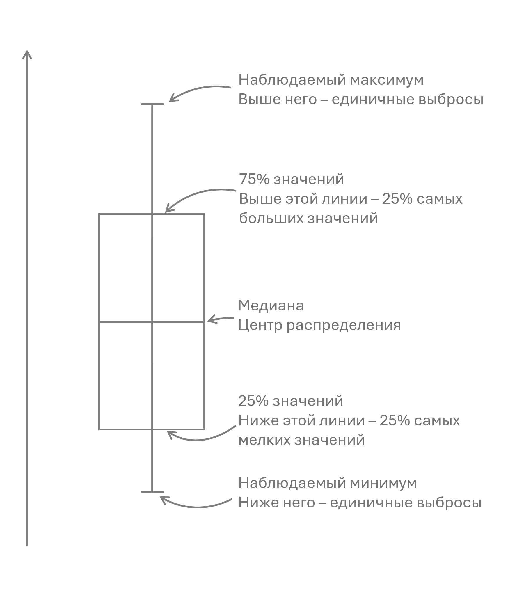

<style type="text/css">
  body{
  font-size: 2em;
}

#box{
margin-left: 15% !important
}
</style>

```{r setup, include=FALSE}
knitr::opts_chunk$set(echo = TRUE)


```

```{r data, message=FALSE, warning=FALSE, include=FALSE}

setwd("C:/Users/ex633/OneDrive/Documents/Зарплаты Q32024/")

library(gt)
library(dplyr)
library(ggplot2)
library(forcats)
library(ggthemes)
library(scales)
library(plotly)
library(patchwork)
library(readxl)
library(ggiraph)

Data <- read_excel("Чищенные данные.xlsx")
Data <- Data %>% mutate_at(c('Salary', 'SC_size', 'Dcount', 'Bcount', 'Experience'), as.numeric)

Data <- Data %>% 
  mutate(Sphere = factor(Sphere, levels = c(
"Консалтинг",
"Маркетинговые и рыночные исследования",
"UX/CX исследования",
"Социологические и политические исследования",
"Академические исследования, преподавание"),
ordered = F))

Data <- Data %>% 
  mutate(Company_type = factor(Company_type, levels = c(
    "Консалтинг",
    "Исследовательские и аналитические агентства",
    "Сфера услуг",
    "IT-компании",
    "Производство и торговля",
    "Банки",
    "Образование",
    "Фриланс",
    "Государственные и бюджетные учреждения"),
    ordered = F))

Data <- Data %>% 
  mutate(Status = factor(Status, levels = c(
    "Независимый исполнитель, фрилансер",
    "Стажер, практикант",
    "Исполнитель, сотрудник в отделе",
    "Ведущий сотрудник",
    "Руководитель, тимлид",
    "Топ-менеджмент, директор, руководитель направления",
    "Руководитель компании, генеральный директор"
  ), ordered= T))

Data <- Data %>% 
  mutate(SC_date = factor(SC_date, levels = c(
    "Меньше 3 месяцев назад",
    "От 3 до 6 месяцев назад",
    "От 7 до 12 месяцев назад",
    "Больше 12ти месяцев назад"
    ), ordered= T))

Data <- Data %>% 
  mutate(SC_reason = factor(SC_reason, levels = c(
    "Ревью",
    "Повышение по должности",
    "Индексация",
    "Самостоятельно инициировали",
    "Смена работы"
  ), ordered= F))

Data <- Data %>% 
  mutate(Level = factor(Level, levels = c(
    "Начинающий специалист, junior", 
    "Специалист с опытом, middle",
    "Старший специалист, senior", 
    "Ведущий специалист, lead",
    "Рок-звезда, легенда"), ordered= T))


Data <- Data %>% 
  mutate(QoQ = factor(QoQ, levels = c(
    "Исследователь-качественник",
    "Исследователь-количественник",
    "И то, и другое"
  ), ordered= F))

Data <- Data %>% 
  mutate(State = factor(State, levels = c(
    "Россия",
    "Ереван",
    "Казахстан",
    "Грузия",
    "Сербия",
    "Черногория",
    "Турция",
    "Португалия",
    "Беларусь",
    "Сингапур",
    "Кипр",
    "Аргентина",
    "Австралия",
    "Узбекистан",
    "Хорватия",
    "Приднестровская Молдавская Республика",
    "Кыргызстан"
  ), ordered= F))

Data <- Data %>%
  rename("Зарплата" = Salary,                                                                
"Сфера исследований" = Sphere,                                                                
"Тип компании" = Company_type,                                                          
"Статус исследователя" = Status,                                                                
"Последнее повышение" = SC_date,                                                               
"Причина повышения" = SC_reason,                                                             
"Размер повышения" = SC_size,                                                               
"Количество обязанностей" = Dcount,                                                                
"Количество подчиненных" = Bcount,                                                                
"Профессиональный уровень" = Level,                                                                 
"Тип исследователя" = QoQ,                                                                   
"Года опыта" = Experience,                                                            
"Страна" = State,                                                                 
"Город" = City  )


```

## Небольшое введение 

Это анализ датасета, собранного в летом-осенью 2024 года рамках анонимного зарплатного опроса исследователей. Ссылка на опрос рассылалась в телеграм чатах и каналах исследователей разных сфер.

Саму анкету для сбора данных можно посмотреть [тут](https://forms.gle/EdybaDFf3kXRar8E8).

Отдельное спасибо чатам и каналам, которые помогли собрать эти данные: 

 *  Research Ops Community Russia 
 [→](https://researchops.ru/)
 *  Чат Рисёрчеров 
 [→](https://researcher-online.ru/)
 *  Канал "UX Horn" 
 [→](https://t.me/uxhorn)
 *  Канал "Мал да удал(и)" 
 [→](https://t.me/maldaudal_i)
 *  Канал "Speaking about my research" 
 [→](https://t.me/uxresearchux)
 
## Как читать ящик с усами 

Далее будет много графиков типа "Ящик с усами", поэтому для вашего удобства я заранее хочу показать, как правильно такие графики читать.

Ящик с усами показывает, как распределены данные. Коробка в центре отображает основную часть значений: нижняя граница — маленькие значения (меньше, чем 75% значений), верхняя — большие (больше, чем 75% значений). Линия внутри коробки показывает середину данных (медиана). "Усы" выходят за пределы коробки и охватывают значения, которые близки к основным. Точки за пределами усов — это редкие или необычные значения.

{#box width=70% margin-left=15%}

## О датасете

Всего в опросе приняло участие 545 человек. После чистки датасета осталось 515 человек. 
Распределение по сферам вышло следующим: 

```{r, out.width="90%", out.height="30%", fig.height=4, warning=FALSE, echo=FALSE}
Data %>% count(`Сфера исследований`) %>% arrange(desc(n)) %>% rename("Количество" = n) %>% 
  ggplot(aes(fct_reorder(`Сфера исследований`, `Количество`),`Количество`)) +
  geom_col(fill='gray', width = 0.5, position = position_dodge(0.9)) +   coord_flip() +
  scale_x_discrete(labels = label_wrap(width = 15)) +
  geom_text(aes(label = signif(`Количество`)), nudge_y = 10, size=4, color = '#3b3b3b') +
  ggtitle('Количество специалистов в разных сферах исследований') + theme_void() + theme(
    axis.text.y = element_text(size = 12, hjust=1,vjust=0.5),
    text = element_text(color = '#3b3b3b'),
    plot.title = element_text(size = 14, hjust = 0.5, vjust = 0.1)
  ) 


```

С учетом того, где мы собирали данные, достаточное количество человек набралось в основном в UX/CX-сфере и маркетинговых исследованиях.

Остальные распределения можно посмотреть тут в табличном виде:

<details style="margin: 0; padding: 0;">
  <summary style = "font-size: 22px;  cursor: pointer !important;">Посмотреть основные распределения</summary>
     <pre style="margin: 0; padding: 0;">
```{r eval=TRUE, echo=FALSE, message=FALSE, results='asis'}
Data %>% group_by(`Тип компании`) %>% summarise(Доля = n() / nrow(.) ) %>% arrange(desc(n=Доля)) %>%  gt %>%
  tab_options(table.width = pct(100), column_labels.font.weight = 'bold', table.additional_css = "div {padding-top: 0px !important;}") %>% 
  cols_align(align = "left", columns = 1) %>% fmt_percent(columns=Доля, decimals=0) %>% as_raw_html( inline_css = TRUE) %>% cat()
Data %>% group_by(`Статус исследователя`) %>% summarise(Доля = n() / nrow(.) ) %>% na.omit() %>% gt %>%
  tab_options(table.width = pct(100), column_labels.font.weight = 'bold') %>% 
  cols_align(align = "left", columns = 1) %>% fmt_percent(columns=Доля, decimals=0) %>% as_raw_html() %>% cat()
Data %>% group_by(`Профессиональный уровень`) %>% summarise(Доля = n() / nrow(.) ) %>% na.omit() %>% gt %>%
  tab_options(table.width = pct(100), column_labels.font.weight = 'bold') %>% 
  cols_align(align = "left", columns = 1) %>% fmt_percent(columns=Доля, decimals=0) %>% as_raw_html() %>% cat()
Data %>% group_by(`Тип исследователя`) %>% summarise(Доля = n() / nrow(.) ) %>% na.omit() %>% gt %>%
  tab_options(table.width = pct(100), column_labels.font.weight = 'bold') %>% 
  cols_align(align = "left", columns = 1) %>% fmt_percent(columns=Доля, decimals=0) %>% as_raw_html() %>% cat()
Data %>% group_by(`Страна`) %>% summarise(Доля = n() / nrow(.) ) %>% na.omit() %>% gt %>%
  tab_options(table.width = pct(100), column_labels.font.weight = 'bold') %>% 
  cols_align(align = "left", columns = 1) %>% fmt_percent(columns=Доля, decimals=2) %>% as_raw_html() %>% cat()

```
    </pre>
</details>


### Зарплаты по сферам 

Если смотреть по сферам исследований, то медианная зарплата больше всего в консалтинге. Но с учетом количества респондентов из этой сферы, на такие данные сложно опираться. Если смотреть на более наполненные ячейки, то мы видим что в UX/CX сфере медианная зарплата немного больше.

```{r, out.width="100%", out.height="30%", fig.height=6, warning=FALSE, echo=FALSE}
plot <- Data %>% select(`Зарплата`,`Сфера исследований`) %>% na.omit() %>% 
  ggplot(aes(`Сфера исследований`, `Зарплата`)) +  geom_boxplot(alpha=0.4) + geom_point_interactive(alpha=0.4, size=2, tooltip = as.character.numeric_version(Data$Зарплата)) + scale_x_discrete(labels = label_wrap(width = 15))+
  scale_y_continuous(labels = comma, n.breaks = 9) + theme(
    axis.text.y = element_text(size = 12, hjust=1,vjust=0.5),
    text = element_text(color = '#3b3b3b'),
    plot.title = element_text(size = 14, hjust = 0.5, vjust = 0.1)
  ) 

girafe(ggobj = plot)

```

```{r filter, message=FALSE, warning=FALSE, include=FALSE}

spheres <- c("Маркетинговые и рыночные исследования", "UX/CX исследования")
Data2 <- Data %>% filter(`Сфера исследований` %in% spheres) 

```

## Зарплаты по уровню

Дальше мы возьмем две наиболее наполненные сферы исследований и посмотрим, как в них распределяются зарплаты по уровню исследователя.
```{r, out.width="100%", out.height="30%", fig.height=10, warning=FALSE, echo=FALSE}

Data2 <- Data %>% filter(`Сфера исследований` %in% spheres) %>% 
  select(`Зарплата`,`Сфера исследований`, `Профессиональный уровень`) %>% na.omit()
plot <- ggplot(Data2, aes(`Профессиональный уровень`, `Зарплата`)) +  geom_boxplot(alpha=0.4) + 
  geom_point_interactive(alpha=0.4, size=2, tooltip = as.character.numeric_version(Data2$`Зарплата`)) + 
  scale_x_discrete(labels = label_wrap(width = 15))+
  scale_y_continuous(labels = comma, n.breaks = 9) + theme(
    axis.text.y = element_text(size = 12, hjust=1,vjust=0.5),
    text = element_text(color = '#3b3b3b'),
    plot.title = element_text(size = 14, hjust = 0.5, vjust = 0.1)
  ) + facet_grid(rows = vars(`Сфера исследований`))

girafe(ggobj = plot)
```

Мы видим небольшую прогрессию медианной зарплаты в зависимости от уровня, что уже неплохо. Но при этом можно заметить, что наибольшее количество аутлаеров у нас находится среди ведущих исследователей. Рок-звезды и в маркетинге и в UX/CX оказались немного более скромными. 

## Зарплаты по типу компании

Мне стало интересно, а где у нас находятся эти аутлаеры с миллионными зарплатами, и я решил посмотреть распределение по типу компаний. И здесь мы видим, что чтобы получать больше 1 000 000 в месяц, нужно работать в агентстве или в IT-компании. Но при этом медианная зарплата в IT выше, чем у агентств, так что скорее всего более выгодно идти inhouse-исследователем в IT.

```{r, out.width="100%", out.height="30%", fig.height=6, warning=FALSE, echo=FALSE}

Data2 <- Data %>% select(`Зарплата`,`Тип компании`) %>% na.omit()
plot <- ggplot(Data2, aes(`Тип компании`, `Зарплата`)) +  geom_boxplot(alpha=0.4) + 
  geom_point_interactive(alpha=0.4, size=2, tooltip = as.character.numeric_version(Data2$`Зарплата`)) + 
  scale_x_discrete(labels = label_wrap(width = 10))+
  scale_y_continuous(labels = comma, n.breaks = 9) + theme(
    axis.text.y = element_text(size = 10, hjust=1,vjust=0.5),
    axis.text.x = element_text(size = 6),
    text = element_text(color = '#3b3b3b'),
    plot.title = element_text(size = 14, hjust = 0.5, vjust = 0.1)
  ) 

girafe(ggobj = plot)
```


## Зарплаты по должности 

Здесь мне все же кажется, что важным может быть не только профессиональная самооценка, но и должность, которую человек занимает (удивительно!).

```{r, out.width="100%", out.height="30%", fig.height=6, warning=FALSE, echo=FALSE}

Data2 <- Data %>% select(`Зарплата`,`Статус исследователя`, `Тип компании`) %>% na.omit() %>%
  mutate(`Тип компании` = recode(`Тип компании`, "Исследовательские и аналитические агентства" = "Агентство",
                                 "Государственные и бюджетные учреждения" = "ГБУ",
                                 "Производство и торговля" = "Ритейл")) %>% 
  mutate(TT = paste(`Тип компании`, as.character.numeric_version(`Зарплата`), sep = "\n"))
plot <- ggplot(Data2, aes(`Статус исследователя`, `Зарплата`, color=Data2$`Тип компании`)) + geom_boxplot(alpha=0.2, color='grey') +  geom_point_interactive(alpha=0.4, size=2, tooltip = Data2$TT) + 
  scale_x_discrete(name = "Должность", labels = label_wrap(width = 10))+
  scale_y_continuous(labels = comma, n.breaks = 9) + theme(
    axis.text.y = element_text(size = 10, hjust=1,vjust=0.5),
    axis.text.x = element_text(size = 6),
    text = element_text(color = '#3b3b3b'),
    plot.title = element_text(size = 14, hjust = 0.5, vjust = 0.1),
    legend.position = "bottom",
    legend.text = element_text(size=8),
    legend.box = "vertical",
    legend.key = element_rect(fill = "white")
  )  + labs(color='Тип компании') 

girafe(ggobj = plot)
```


И здесь мы видим, что аутлаеры в агентствах появляются в основном за счет генеральных директоров и руководителей компании. То есть если хочется зарабатывать большие деньги в агентстве, то есть резон открывать свое. Если же руководящая должность, но не топ-менеджмент, то лучше в IT.


## Зарплаты по годам опыта

Давайте посмотрим, а насколько сильно зависит уровень зарплаты от опыта. 

В принципе, зависимость не явная, но есть. Видно, что линия тренда по линейной модели немножко смотрит вверх. Но в основном это за счет респондентов с менее чем 5 годами опыта. Дальше уже, судя по всему, размер зарплаты зависит не столько от опыта, сколько от умения себя продать.

``` {r, out.width="100%", out.height="30%", fig.height=6, warning=FALSE, echo=FALSE, message = FALSE}
Data2 <- Data %>% select('Зарплата', 'Года опыта') %>% na.omit()
plot <- ggplot(Data2, aes(`Года опыта`, `Зарплата`)) + geom_point_interactive(alpha=0.4, size=2, tooltip = as.character.numeric_version(Data2$`Зарплата`)) + scale_y_continuous(labels = comma, n.breaks = 9) + stat_smooth(method=lm)
girafe(ggobj = plot) 
```

## Количество опыта по профессиональному уровню 

Здесь интересно посмотреть в разрезе сфер исследований. Тут мы видим, что да, уровень более-менее зависит от опыта, что славно. Но при этом в UX/CX-исследованиях все же более быстрая прогрессия, чем в маркетинге. Возможно, потому что сфера более молодая.

```{r, out.width="100%", out.height="30%", fig.height=6, warning=FALSE, echo=FALSE}

Data2 <- Data %>% filter(`Сфера исследований` %in% spheres) %>%   
  select(`Года опыта`,`Профессиональный уровень`, `Сфера исследований`) %>% na.omit()
plot <- ggplot(Data2, aes(`Профессиональный уровень`, `Года опыта`)) +  geom_boxplot(alpha=0.4) + 
  geom_point_interactive(alpha=0.4, size=2, tooltip = as.character.numeric_version(Data2$`Года опыта`)) + 
  scale_x_discrete(labels = label_wrap(width = 10))+
  scale_y_continuous(labels = comma, n.breaks = 9) + theme(
    axis.text.y = element_text(size = 10, hjust=1,vjust=0.5),
    axis.text.x = element_text(size = 6),
    text = element_text(color = '#3b3b3b'),
    plot.title = element_text(size = 14, hjust = 0.5, vjust = 0.1)
  ) + facet_grid(rows = vars(`Сфера исследований`))

girafe(ggobj = plot)
```
## Как давно повышали 

Если смотреть на дату последнего повышения, то мы видим, что большинство респондентов повысили менее чем год назад. Это радостно.

```{r, out.width="100%", out.height="30%", fig.height=4, warning=FALSE, echo=FALSE}
Data %>% group_by(`Последнее повышение`)   %>% na.omit() %>% summarise(Доля = round(n() / nrow(.)* 100, digits = 0)) %>%
  ggplot(aes(fct_reorder(`Последнее повышение`, `Доля`),`Доля`)) +
  geom_col(fill='gray', width = 0.5, position = position_dodge(0.9)) +   coord_flip() +
  scale_x_discrete(labels = label_wrap(width = 15)) +
  geom_text(aes(label = paste0(`Доля`, "%")), nudge_y = 2, size=4, color = '#3b3b3b') +
  ggtitle('Когда повышали в последний раз') + theme_void() + theme(
    axis.text.y = element_text(size = 12, hjust=1,vjust=0.5),
    text = element_text(color = '#3b3b3b'),
    plot.title = element_text(size = 14, hjust = 0.5, vjust = 0.1)
  ) + scale_y_continuous(labels = scales::percent)


```

При этом среди причин повышений наиболее частая - это регулярное ревью сотрудников. Возможно это что-то говорит о зрелости нашей HR-культуры.

```{r, out.width="100%", out.height="30%", fig.height=4, warning=FALSE, echo=FALSE}
Data %>% group_by(`Причина повышения`) %>% na.omit() %>%  summarise(Доля = round(n() / nrow(.)* 100, digits = 0)) %>%
  ggplot(aes(fct_reorder(`Причина повышения`, `Доля`),`Доля`)) +
  geom_col(fill='gray', width = 0.5, position = position_dodge(0.9)) +   coord_flip() +
  scale_x_discrete(labels = label_wrap(width = 15)) +
  geom_text(aes(label = paste0(`Доля`, "%")), nudge_y = 2, size=4, color = '#3b3b3b') +
  ggtitle('Почему повысили') + theme_void() + theme(
    axis.text.y = element_text(size = 12, hjust=1,vjust=0.5),
    text = element_text(color = '#3b3b3b'),
    plot.title = element_text(size = 14, hjust = 0.5, vjust = 0.1)
  ) + scale_y_continuous(labels = scales::percent)


```


## Насколько сильно повышали 

Размер повышения особо не зависит от того, как давно повышали. Значит мы с сильной натяжкой, но все же можем говорить о том, что сильной динамики размера повышений не наблюдается.

```{r, out.width="100%", out.height="30%", fig.height=4, warning=FALSE, echo=FALSE}

Data2 <- Data %>% select(`Размер повышения`,`Последнее повышение`) %>% na.omit()
plot <- ggplot(Data2, aes(`Последнее повышение`, `Размер повышения`)) +  geom_boxplot(alpha=0.4) + 
  geom_point_interactive(alpha=0.4, size=2, tooltip = as.character.numeric_version(Data2$`Размер повышения`)) + 
  scale_x_discrete(labels = label_wrap(width = 10))+
  scale_y_continuous(labels = comma, n.breaks = 9) + theme(
    axis.text.y = element_text(size = 10, hjust=1,vjust=0.5),
    axis.text.x = element_text(size = 6),
    text = element_text(color = '#3b3b3b'),
    plot.title = element_text(size = 14, hjust = 0.5, vjust = 0.1)
  ) 

girafe(ggobj = plot)

```

Но при этом мы можем говорить о том, что проще получить большое повышение при смене работы, чем другими способами. Медианный размер повышения у повышения по должности и смены работы близок, но при этом у нас верхний квартиль размера зарплаты выше у смены должности. А это значит, что больше крупных повышений находятся именно в этой причине.

```{r, out.width="100%", out.height="30%", fig.height=4, warning=FALSE, echo=FALSE}

Data2 <- Data %>% select(`Размер повышения`,`Причина повышения`) %>% na.omit()
plot <- ggplot(Data2, aes(`Причина повышения`, `Размер повышения`)) +  geom_boxplot(alpha=0.4) + 
  geom_point_interactive(alpha=0.4, size=2, tooltip = as.character.numeric_version(Data2$`Размер повышения`)) + 
  scale_x_discrete(labels = label_wrap(width = 10))+
  scale_y_continuous(labels = comma, n.breaks = 9) + theme(
    axis.text.y = element_text(size = 10, hjust=1,vjust=0.5),
    axis.text.x = element_text(size = 6),
    text = element_text(color = '#3b3b3b'),
    plot.title = element_text(size = 14, hjust = 0.5, vjust = 0.1)
  ) 

girafe(ggobj = plot)

```

## В заключение 

В датасете гораздо больше данных, чем я проанализировал тут. Если вам интересны другие разрезы, или переменные, или перекодировать данные, то вы легко можете скачать почищенные данные [тут]("Чищенные данные.xlsx").

По всем вопросам можете писать мне в [телеграм](https://t.me/keycee) или на почту mail@uxrozum.com, спасибо за внимание! 